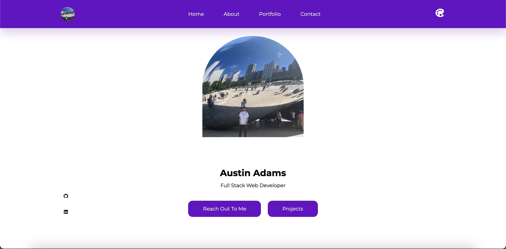
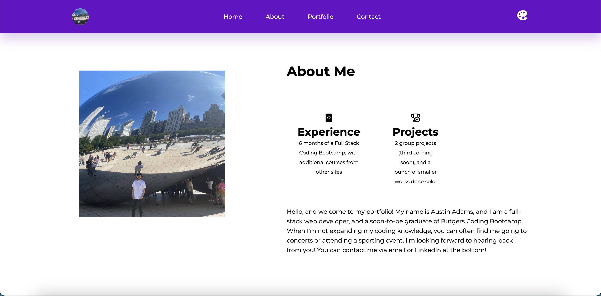
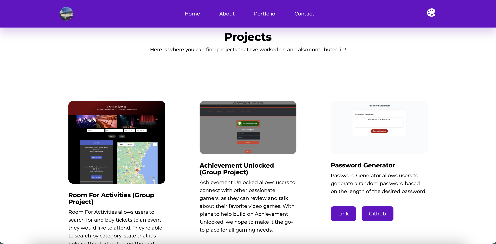

# react-portfolio

## Description
Built by using React, this portfolio showcases a collection of my projects, skills, and experiences. The portfolio is designed to provide an attractive and user-friendly interface that highlights my abilities and accomplishments. When viewing the portfolio, the user can easily navigate to different sections by clicking on the sections featured in the navbar. The project section displays both the deployed and github links to each project. Additionally, the user can also change the color of the theme by clicking the button on the far right of the navbar as well!

## Installation
- Run `npm install` to install everything needed.

## Usage
To create a react app, run the following command in the terminal: 

- `npx create-react-app`

## Contributing
N/A

## Questions?
Feel free to ask any questions you may have by reaching out to the following:

Github: https://github.com/Austin1094
Email: Austin.Adams1094@gmail.com